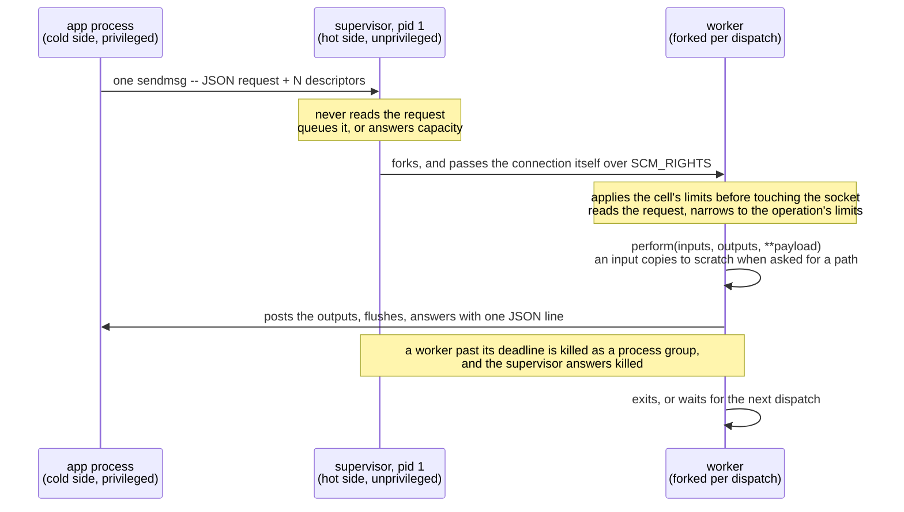

# HotCell

Securely run untrusted code on untrusted inputs. HotCell lets you move that work out of your application
and into an unprivileged sibling container: no network, no credentials, and nothing on its filesystem
worth stealing.

Inputs and outputs travel as file descriptors over a UNIX socket on a shared volume. Each call is a
remote procedure call ("RPC"): your application calls an ordinary Ruby method, the arguments are
forwarded to the container where the work runs in a forked worker process with strict limits
applied, and the results are returned or written to the output file.

## Status

This is still pre-release software! It may break in interesting ways. Use with caution until there's a v1.0 release.

The `activestorage-hotcell-client` gem needs Rails 8.2, which is unreleased: variant processing can only
be swapped out from [rails/rails#58384](https://github.com/rails/rails/pull/58384)
([`5ea765e5`](https://github.com/rails/rails/commit/5ea765e5b00085a22f5cbe863c0d2ac765428242)) onward. Track
`rails/rails` `main` until it ships — see [README-active-storage.md](README-active-storage.md).

## "Why would I use this?"

Your Rails application accepts uploads, so somewhere in it there's a line like this:

```ruby
blob.variant(resize_to_limit: [ 800, 600 ]).processed
```

If you think about what that line actually does, it's scary. An attacker just handed you a crafted
file, and Rails is about to hand it to libvips -- a few hundred thousand lines of C whose entire job
is to guess at file formats it has never seen before and delegate handling to ANOTHER
format-specific library that you may not even be aware of.

libvips, ImageMagick, ffmpeg and LibreOffice all have long histories of memory-safety bugs, and
every one of them is running by default in the same container that holds your database credentials,
your session secret, and a route to every network service the app uses. The potential blast radius
is large.

HotCell gives that work its own container and its own forked process, holding nothing an attacker
wants. Take libvips and ffmpeg out of your application image entirely and keep them isolated in the
Cell. Code execution in that process buys an attacker a read-only input descriptor, a write-only
output descriptor, and the scratch of whatever else the cell is converting. The blast radius is much
smaller than if that attack succeeded in your application code.

If you're a Rails developer, this project also ships drop-in replacements for the Active Storage
analyzers, transformers, and previewers so that using HotCell only requires configuration changes,
not code changes.

In our environment, using HotCell adds about 8 milliseconds per call, and one more container to
deploy on each host. We think this is a very good trade for the improved security posture.

## Extensibility

HotCell was designed to be flexible and configurable beyond just the media conversion use case:

- multiple cells can be configured per host
- multiple input and output files are supported
- custom operations have a simple Active-Job-like `#perform` API
- cell limits are configurable: memory, wall clock time, disk usage, and more
- bring your own container by using the included conformance test
- customize how often workers are re-forked, for performance optimization

So you could try using HotCell for handling ZIP files, or for compute workloads that might be CPU
hogs. Whatever is putting your trusted core application at risk, move it out!

## The gems

| Gem | Runs in | Contains |
| --- | --- | --- |
| `hotcell-core` | both sides | The wire protocol, descriptor passing, payload validation, the error taxonomy. |
| `hotcell-client` | the application | `HotCell::Client`, cell registration, routing, classification, instrumentation. |
| `hotcell-server` | the cell | The supervisor, the worker, `HotCell::Operation`, the container image. |
| `activestorage-hotcell-client` | the application | The transformer, analyzer, and previewers Rails is configured with. |
| `activestorage-hotcell-server` | the cell | The `transformers.image.*`, `analyzers.image.*`, `analyzers.media.ffprobe`, and `previewers.*` operations. |

They are in one repository because they are being developed together today. We may split out the
Active Storage gems into another repository at a later date.

## The moving parts

A **cell** is one deployment of the hot side: a supervisor, the workers it forks, and the operations
they serve, reachable through two unix sockets in one directory. A cell is the unit of isolation and
the unit of capacity. An application may register several cells by calling `HotCell.register` for
each one.

The **supervisor** is pid 1 in the cell. It accepts connections, queues them, dispatches each to a
worker, enforces the wall-clock deadline from outside, kills and reaps. It never reads a request and
never evaluates a byte of image data -- it hands the accepted connection itself to a worker over
`SCM_RIGHTS` without ever calling `recvmsg`, so the caller's descriptors are still queued on it when
the worker reads them.

A **worker** is a child the supervisor forks. Every untrusted byte is touched there and nowhere
else. It applies the cell's resource limits before touching the socket, serves
`max_requests_per_worker` requests, and exits without running finalizers.

A **slot** is the numbered workspace a worker borrows. It holds one directory per request, which is
that request's `$HOME`, with the request's staged files under `scratch` inside it. The whole thing is
created when the request starts and removed before the caller hears the answer, so nothing a tool
writes reaches the next request on that slot.

An **operation** is the unit of work a cell offers: a subclass of `HotCell::Operation` with a
routing name, its own `limits`, and a `perform(inputs, outputs, **payload)` that declares the
payload keys it wants as keyword arguments. The examples above name themselves explicitly. Left
unnamed, both sides derive the same name from the class path, and the cell-side `Operation` suffix
is stripped. So `ExtractTextOperation` in the cell and `ExtractText` in the application both
answer to `extract_text`. The set of operations a cell carries is its **inventory** -- logged at
boot, advertised on the control socket.

A **client** is the application-side mirror of an operation: a subclass of `HotCell::Client` that
names the cell with `hotcell` and the operation with `operation`, and exposes
`perform_in_hotcell`. That is a blocking call -- it sends the request and waits for the cell's
answer, up to the `timeout` the cell was registered with.

A **tool** is a program an operation runs in a subprocess -- `soffice`, `mutool`, `ffmpeg` -- via
`run_tool`, with a fully written environment and bounded capture of its output. The worker waits for
it, and the tool sees only the environment its operation wrote for it.

The **payload** is a `Hash` of options, riding the request as its one JSON object and arriving in
`perform` as keyword arguments; the **result** is the `Hash` an operation returns, riding the
response the same way. Neither carries file contents.

**Inputs** and **outputs** are the open file descriptors a caller passes -- inputs read-only,
outputs write-only. They are the only way file contents enter or leave a cell. Asking one for its
`path` materializes a temporary file on the worker's scratch that a tool can take. An input's bytes
are copied there on the first ask, and an output's file is sent back through the descriptor when
`perform` returns.  An operation that reads or writes the descriptor directly never touches the
disk.

A failure carries a **code** -- `unreadable`, `invalid`, `unsupported`, `failed`, `capacity`,
`unavailable`, `timeout`, `protocol`, or `killed` with a cause -- and each code is **permanent** or
**transient**. Permanent means the input will fail this way every time, so the caller may record
that verdict against it. Everything uncertain is transient, meaning it might succeed on a retry.

## How a request works



1. The application calls `perform_in_hotcell inputs, outputs, payload` on a client class. The client wraps
   each IO as an `Input` or `Output`, verifies its access mode -- inputs read-only, outputs write-only --
   validates the payload, and connects to the cell's `work.sock`.
2. One `sendmsg` carries one JSON line and every descriptor.
3. The supervisor accepts and dispatches, or answers `capacity` when the queue is full.
4. The worker narrows to the operation's limits, clamped to the cell's, before reading any untrusted byte,
   and re-runs `before_worker_boot` when the operation differs from the last one it served.
5. `perform` runs on a fresh operation instance. An `Input` copies itself onto the slot's scratch the first
   time the operation asks for its `path`; an operation that reads the descriptor directly never pays for
   the copy. Outputs are posted back through their descriptors and flushed before success is reported.
6. One JSON line answers: `ok` with the result and the timing, or a failure with its code.
7. The supervisor enforces the deadline from outside, because a thread inside a C extension cannot be
   interrupted from within. A worker past its deadline is killed as a process group, and the supervisor --
   the only survivor holding the connection -- answers `killed` with the cause.
8. The client raises the exception class registered for that side of the permanent split, and publishes a
   `perform.hot_cell` notification either way.

## Usage

### How to get started

Everything about a cell lives in a `hotcell/` directory in the application root, separate from the
client configuration and the application code. That directory holds:

- a `Gemfile` for what the operations need,
- a `Dockerfile` that builds the cell's image,
- a `config.rb` for the cell's own settings, and
- an `operations/` directory of Ruby files the cell loads at boot.

Running `bin/rails hotcell:install` creates all of them.

### Active Storage support

The two `activestorage-hotcell-*` gems are the shipped, worked example of building on HotCell -- the
media operations, and the transformers, analyzers and previewers Rails is configured with. They are
documented in [README-active-storage.md](README-active-storage.md).

### Write an operation

The client class in the application and the matching operation class in the cell share a routing
name. The fixed signature of the `#perform` method -- inputs, outputs, payload -- is the contract
for what crosses the socket. Descriptors travel as-is (without additional copies) and the payload
travels as one JSON object.

In the application, the client class and call site might look like:

``` ruby
class TransformImage < HotCell::Client
  hotcell "images"                # the cell that serves this call, by registered name
  operation "images.transform"    # the routing name an operation must answer to
end

# source and destination are Files the app already opened. This is a blocking call that waits for
# a response from the cell.
TransformImage.perform_in_hotcell source, destination,
                                  format: "png",
                                  operations: { resize_to_limit: [ 800, 600 ] }
```


The operation will run in the cell. Declare the routing name and the limits, hook library loading,
and `#perform`:

```ruby
require "active_support"
require "active_support/core_ext/numeric"   # for 30.seconds and 1280.megabytes

class TransformImageOperation < HotCell::Operation
  operation "images.transform"    # the same routing name

  # Ceilings for one request enforced by rlimits and the supervisor's clock,
  # clamped to the cell's own limits.
  limits deadline: 30.seconds, memory: 1280.megabytes, file_size: 48.megabytes

  before_fork        { require "my_image_processor" }       # once, in the supervisor
  before_worker_boot { MyImageProcessor.concurrency_set 4 } # in forked worker, before it serves a request

  # The descriptors the caller passed, and the payload as keyword arguments. A missing or undeclared
  # key raises, so the signature is the schema. Declare **payload instead to take the Hash whole.
  def perform(inputs, outputs, format:, operations: {})
    source, = inputs
    destination, = outputs

    # fd_path reads the caller's file in place, with no copy onto scratch, so an input of any size
    # costs nothing against file_size. Reach for source.path only when a tool needs a distinct on-disk
    # copy; that stages the bytes, and the kernel charges the write.
    MyImageProcessor.source(source.fd_path)
                    .apply(format:, operations)
                    .write_to(destination.fd_path)

    # The result: one JSON object, which the caller receives as perform_in_hotcell's return value (in
    # addition to the destination file descriptor)
    { format: format, bytes: File.size(destination.path) }
  end
end
```

`before_fork` runs once in the supervisor and must never evaluate an image; `before_worker_boot`
runs in the worker and is where a library gets sized. `unreadable` names the library exceptions that
mean "this input cannot be decoded", a permanent verdict. An operation that shells out calls
`run_tool "mutool", "draw", ...` and gets the exit status and bounded output back; the tool sees
only the environment the operation wrote.

### Configure and build the cell

`bin/rails hotcell:install` writes the `hotcell/` directory -- the `Dockerfile`, the `Gemfile`,
`config.rb`, and an empty `operations/` directory. There is no published base image to inherit from. The
installed Dockerfile is the complete recipe, and it is yours to customize. A file you have already edited
is never overwritten.

In the Dockerfile, install the system packages your operations need:

```dockerfile
# hotcell/Dockerfile (excerpt)
RUN apt-get update && \
    apt-get install -y --no-install-recommends libvips42 mupdf-tools ffmpeg && \
    rm -rf /var/lib/apt/lists/*
```

In `config.rb`, which loads at boot before any operation, declare the cell's own settings:

```ruby
# hotcell/config.rb
require "active_support"
require "active_support/core_ext/numeric"

# configure the cell's limits
HotCell.limits concurrency: 4, queue_size: 8, deadline: 60.seconds, memory: 1536.megabytes

# configure individual operation limits
require "active_storage/hot_cell/server/transformers/image/vips"
ActiveStorage::HotCell::Server::Transformers::Image::Vips.limits file_size: 256 * 1024**2
```

The image's entrypoint is `hotcell`, which loads `config.rb`, then the operations in sorted order, and
boots the supervisor on `HOTCELL_DIR`.

### Run it in development

A cell can run in development either as a container or as a plain, uncontainerized process. The
container route works only on Linux (on macOS the containers run in a VM, and descriptor passing
will not work). The resource limits and the deadline apply either way.

We recommend the uncontainerized process in development, managed by foreman beside the Rails server,
so there is one setup to document and one to debug. Give the cell its own directory in the app
repository, with its own `Gemfile` -- the same one the image build copies -- and add one line per cell
to `Procfile.dev`:

```procfile
web: HOTCELL_ROOT=$PWD/tmp/hotcell-sockets bin/rails server
cell: BUNDLE_GEMFILE=$PWD/hotcell/Gemfile HOTCELL_CONFIG=$PWD/hotcell/config.rb HOTCELL_OPERATIONS=$PWD/hotcell/operations HOTCELL_DIR=$PWD/tmp/hotcell-sockets/documents bundle exec hotcell
```

`bin/dev` boots both. The app finds the sockets under `tmp/hotcell-sockets`, and the cell keeps its own bundle
so the two sides stay separate in development the way they are in production.

### Deploy it

A cell is a second container beside the application, on the same host, sharing one volume that holds
its sockets. [docs/TUNING.md](docs/TUNING.md) covers arriving at specific configuration parameters
for your own workload. [docs/DEPLOYMENT.md](docs/DEPLOYMENT.md) has a complete explanation.

Here's an illustrative Kamal configuration deploying one accessory per cell and setting `network: none`.

```yaml
accessories:
  documents:
    image: your.registry.com/your-image:latest
    roles: [ web, jobs ]                        # a cell always lives on its caller's host
    network: none                               # an accessory key, never an option
    volumes:
      - hotcell-sockets:/run/hotcell/cell       # the sockets the app talks to this cell through
    options:
      # Performance. No defaults. Docker applies no limit to a flag you omit.
      cpus: 2
      memory: 2g
      memory-swap: 2g                           # equal to memory, or swap defeats the limit

      # Security. All of these, every time. Omit one and the protection is gone while
      # the cell keeps serving requests exactly as before.
      read-only: true
      cap-drop: ALL
      security-opt: no-new-privileges:true
      user: 10001:10001
      pids-limit: 512
      tmpfs: /tmp:rw,nosuid,nodev,noexec,size=512m
```

Note that with this Kamal config, the application's own roles need `group-add: 10001`, the cell's
gid, because we recommend the cell processes run as a different user than the application processes.

### Point a client at it

Register the cell once, with the application's own exception classes for the two
sides of the permanent split, then declare a client per operation:

```ruby
HotCell.root = ENV["HOTCELL_ROOT"]              # unset means every cell is off
HotCell.group = ENV["HOTCELL_GROUP"]&.to_i      # the cell's gid; unset where both sides are one user

HotCell.register "documents",
  permanent: MyApp::UnreadableDocument,
  transient: MyApp::ConversionTemporarilyUnavailable

class ExtractText < HotCell::Client
  hotcell "documents"
  operation "documents.extract_text"
end

result = ExtractText.perform_in_hotcell source, destination
result[:pages]
```

`HotCell.root` names the directory that holds one subdirectory of sockets per cell, so this cell's
live at `$HOTCELL_ROOT/documents`. In production that is the shared volume. The accessory above
mounts `hotcell-sockets` at `/run/hotcell/cell`, the app mounts the same volume at
`/run/hotcell/documents`, and `HOTCELL_ROOT` is `/run/hotcell`. In development a cell runs
uncontainerized, so use the app's own scratch space -- set `HOTCELL_ROOT=tmp/hotcell-sockets` and
boot the cell with `HOTCELL_DIR=tmp/hotcell-sockets/documents`. Leaving `HOTCELL_ROOT` unset turns
every cell off -- `enabled?` answers false, and `perform_in_hotcell` raises
`HotCell::CellNotConfigured`. There is no automatic in-process fallback. A caller that wants one
checks `enabled?` and takes its old path, which is how an application rolls this out as a
configuration change rather than a release.

A subclass inherits `hotcell` and not `operation`. The operation name is the wire name, and a subclass
that inherited it would answer to the same name as its parent, so it derives its own from its class path
unless it declares one. Subclass a shipped client to change its cell, and redeclare `operation` if the
name must stay.

## Observability

Some strategies that are working for us to monitor HotCell, which we recommend you add to your
application. (Some of these things may show up more-fully-formed in a future release.)

### Metrics collection

Poll `cell.metrics` on a schedule, for example with a [Yabeda](https://github.com/yabeda-rb/yabeda)
`collect` block. The control socket answers even while the work socket is saturated, and it is
host-local, so the poller must be a process on the cell's own host. Watch `queued`,
`queue_high_water`, `cancelled`, and `killed_by` cause.

### Per-call telemetry

Subscribe to the `perform.hot_cell` Active Support Notification for logging, metrics, or both. It
fires on every call, success or failure, and it is the only signal that survives a dead cell -- an
unreachable socket comes back as code `unavailable`, so the primary alarm belongs here.

### Container healthcheck

The installed Dockerfile wires `hotcell-health` up as the Docker `HEALTHCHECK`. It probes the
supervisor's control socket from inside the container, where `network: none` does not apply. Healthy
means the supervisor answers, not that a worker is free. If you're using your own container,
remember to use this.

### Rails healthcheck

The cell responds to requests for status and metrics on a separate UNIX socket that won't block on
worker requests. We recommend using this in a Rails controller endpoint like `/up/hotcell` to return
a 200/OK if the cell is responsive.

### Logs

The cell writes one JSON object per event to stdout, so whatever ships your container logs ships
these too. Alert on the presence of `worker.crashed`, and on `worker.killed` by cause. `memory`
means bombs, `deadline` means wedged tools.

## Development

Working on the gems themselves is documented in [CONTRIBUTING.md](CONTRIBUTING.md): how the suites are split,
how a cell is exercised natively and in a container, and the rules that are not obvious from the code.

```
bundle install
rake
```

## Design

[docs/DESIGN.md](docs/DESIGN.md) holds what the code cannot tell you: the threat model, the invariants the
design exists to hold, why descriptors rather than a shared volume, and the facts that were measured rather
than reasoned about. Behavior is the code's to describe, and it does.

[adr/](adr/README.md) describes some decisions that we arrived at during development.
