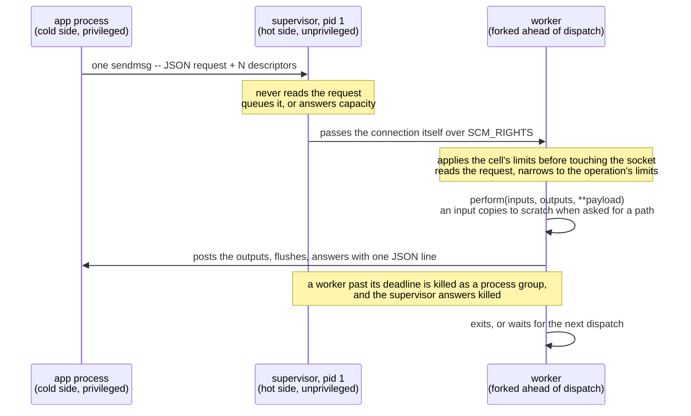

# Request lifecycle

## How a request works

1. The application calls `perform_in_hotcell inputs, outputs, payload` on a client class. The client wraps
   each IO as an `Input` or `Output`, verifies its access mode -- inputs read-only, outputs write-only --
   validates the payload, and connects to the cell's `work.sock`.
2. One `sendmsg` carries one JSON line and every descriptor.
3. The supervisor accepts and dispatches, or answers `capacity` when the queue is full.
4. The worker narrows to the operation's limits, clamped to the cell's, before reading any untrusted byte,
   and re-runs `before_worker_boot` when the operation differs from the last one it served.
5. `perform` runs on a fresh operation instance. An `Input` copies itself onto the slot's scratch the first
   time the operation asks for its `path`; an operation that reads the descriptor directly never pays for
   the copy. Outputs are posted back through their descriptors and flushed before success is reported.
6. One JSON line answers: `ok` with the result and the timing, or a failure with its code.
7. The supervisor enforces the deadline from outside, because a thread inside a C extension cannot be
   interrupted from within. A worker past its deadline is killed as a process group, and the supervisor --
   the only survivor holding the connection -- answers `killed` with the cause.
8. The client raises the exception class registered for that side of the permanent split, and publishes a
   `perform.hot_cell` notification either way.
