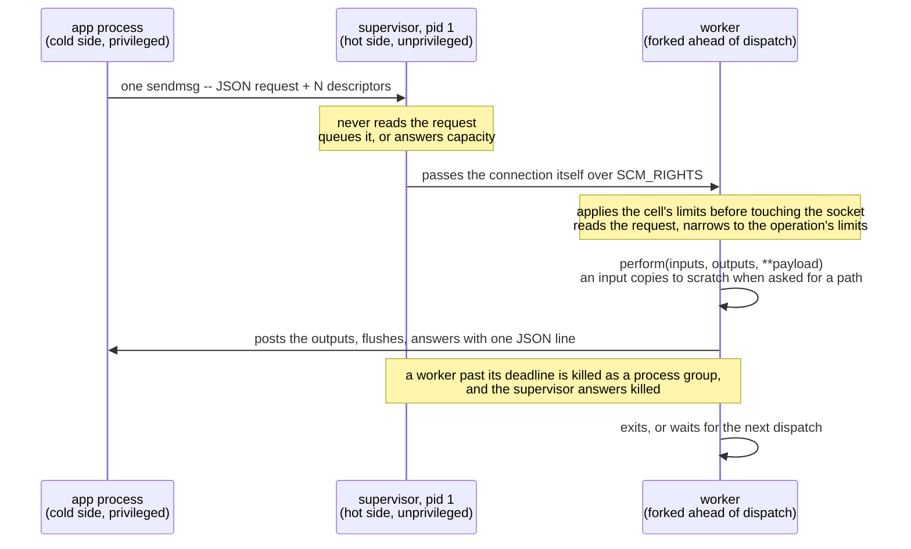

# Request lifecycle

This page describes what happens between a call to `perform_in_hotcell` and its answer. For the terms
used here, see [Concepts](concepts.md).

## Steps

1. The application calls `perform_in_hotcell inputs, outputs, payload` on a client class. The client does
   the following:
   1. Wraps each IO as an `Input` or an `Output`.
   2. Verifies each access mode. Inputs must be read-only and outputs must be write-only.
   3. Validates the payload.
   4. Connects to the cell's `work.sock`.
2. One `sendmsg` call carries one JSON line and every descriptor.
3. The supervisor accepts the connection and dispatches it to a worker. If the queue is full, the
   supervisor answers `capacity` instead.
4. Before the worker reads any untrusted byte, it narrows its limits to the operation's limits, clamped to
   the cell's. If the operation differs from the last one that the worker served, the worker runs
   `before_worker_boot` again.
5. `perform` runs on a new operation instance.
   - An `Input` copies itself onto the slot's scratch the first time that the operation asks for its
     `path`. An operation that reads the descriptor directly doesn't pay for the copy.
   - The worker posts outputs back through their descriptors and flushes them before it reports success.
6. The worker answers with one JSON line: `ok` with the result and the timing, or a failure with its code.
7. The supervisor enforces the deadline from outside the worker, because a thread inside a C extension
   can't be interrupted from within. The supervisor kills a worker that is past its deadline as a process
   group. The supervisor is then the only process that holds the connection, and it answers `killed` with
   the cause.
8. The client raises the exception class that is registered for the failure's side of the permanent
   split. On success and on failure, the client publishes a `perform.hot_cell` notification. See
   [Response codes](codes.md) and [Observability](observability.md#per-call-notification).
